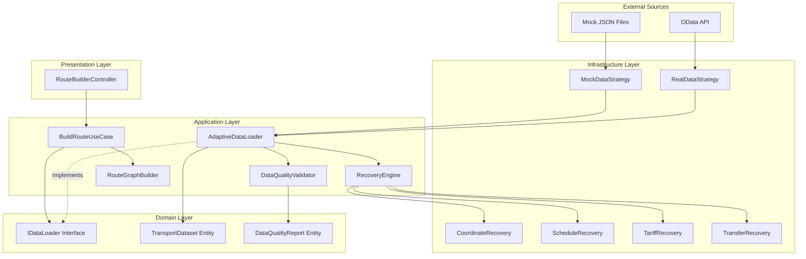
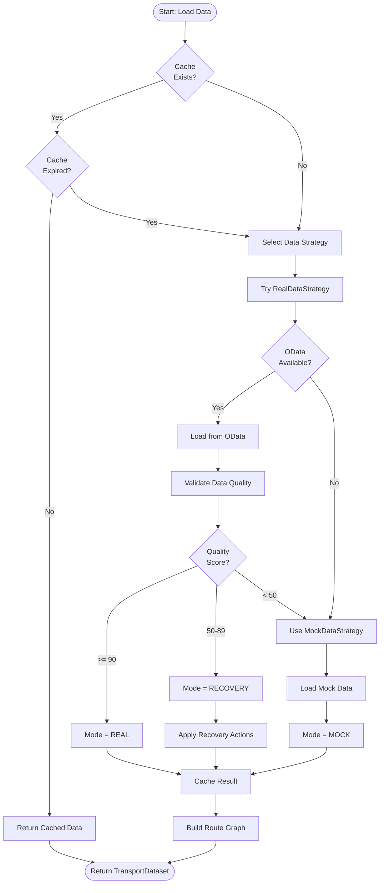
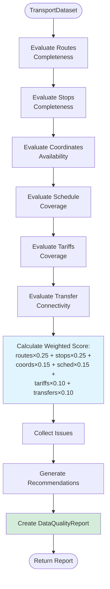
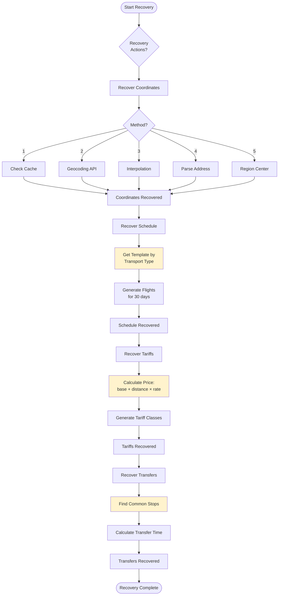
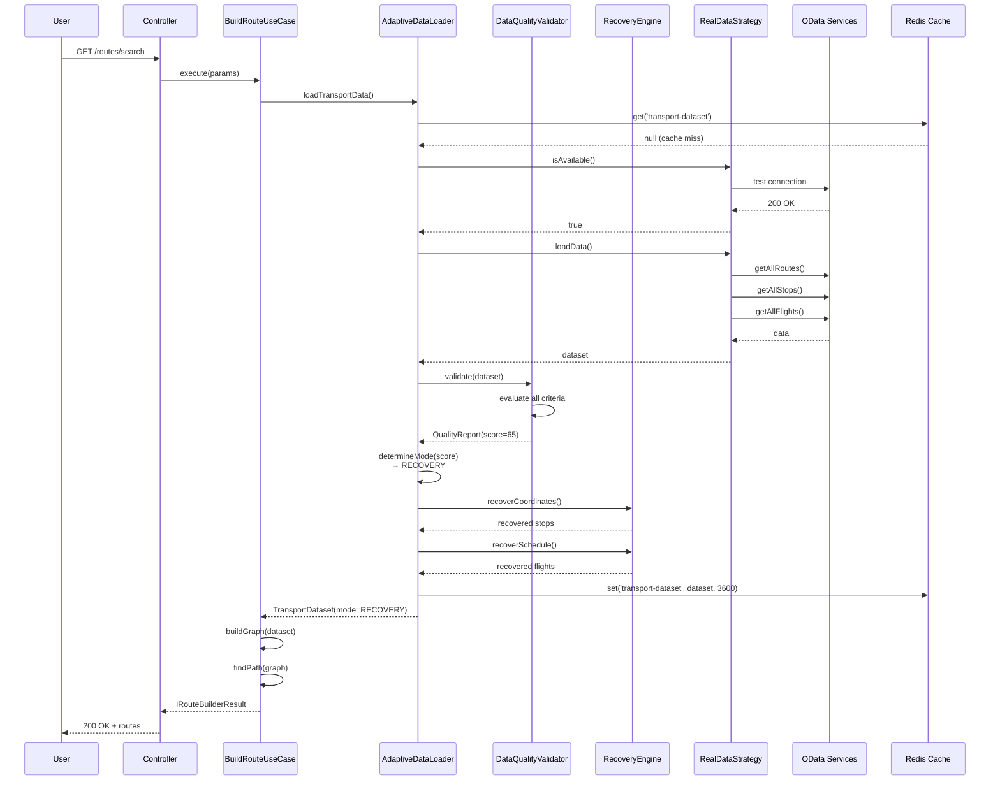
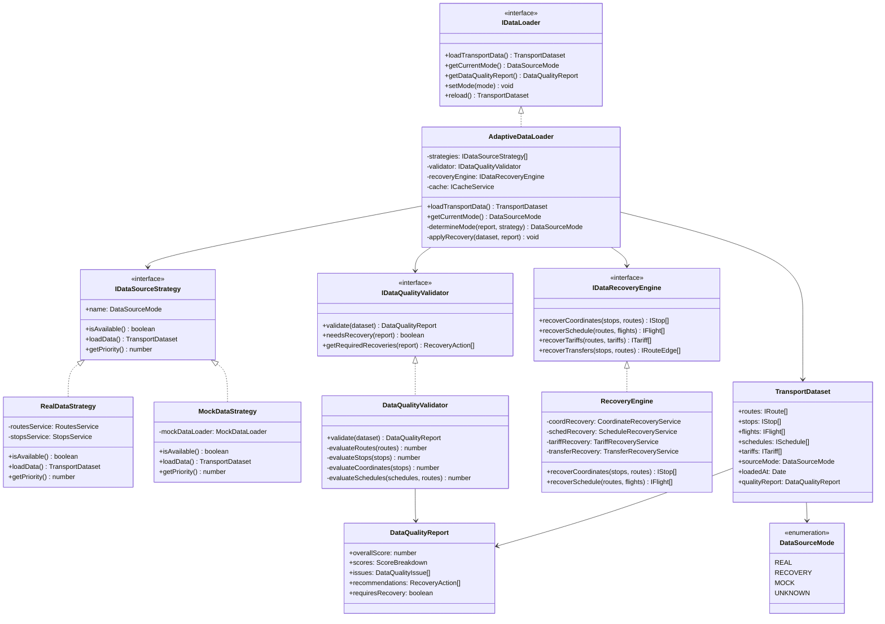
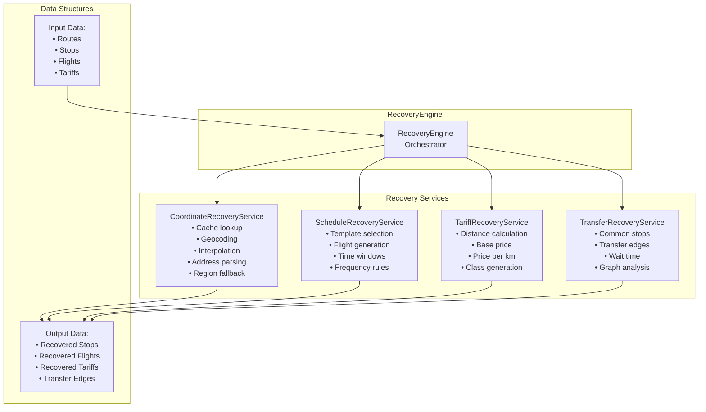
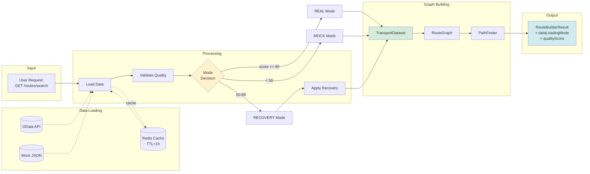
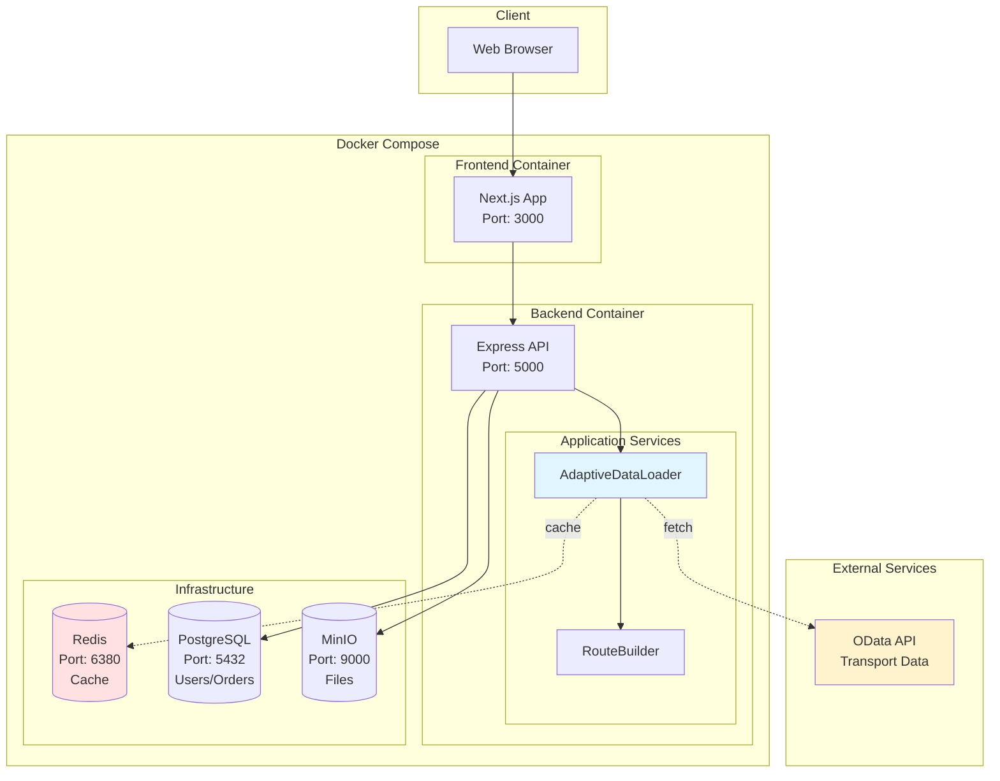
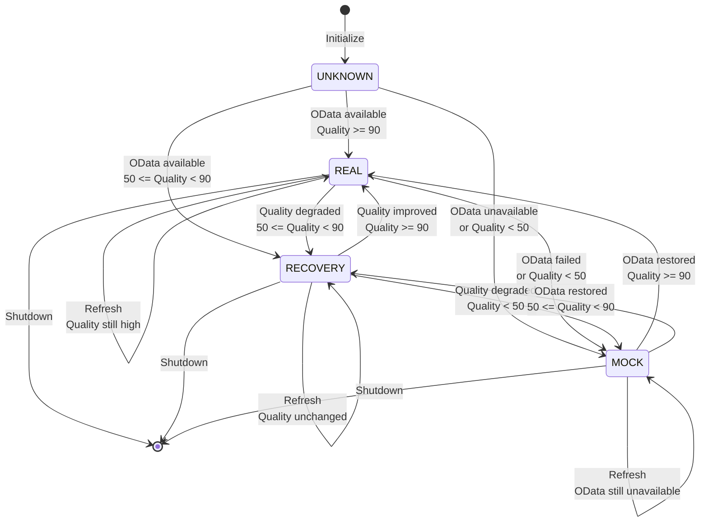

# Диаграммы: Архитектура адаптивной загрузки данных

## 1. High-Level Architecture Diagram



## 2. Mode Selection Flow



## 3. Data Quality Validation Flow



## 4. Recovery Engine Flow



## 5. Component Interaction Sequence



## 6. Class Diagram



## 7. Strategy Pattern Implementation

```mermaid
graph TB
    subgraph "Context"
        AdaptiveLoader[AdaptiveDataLoader<br/>- strategies: IDataSourceStrategy[]]
    end
    
    subgraph "Strategy Interface"
        IStrategy[IDataSourceStrategy<br/>+ isAvailable<br/>+ loadData<br/>+ getPriority]
    end
    
    subgraph "Concrete Strategies"
        Real[RealDataStrategy<br/>Priority: 1<br/>Source: OData]
        Mock[MockDataStrategy<br/>Priority: 3<br/>Source: JSON]
        Future1[RestApiStrategy<br/>Priority: 2<br/>Source: REST API]
        Future2[GraphQLStrategy<br/>Priority: 2<br/>Source: GraphQL]
    end
    
    AdaptiveLoader --> IStrategy
    IStrategy <|.. Real
    IStrategy <|.. Mock
    IStrategy <|.. Future1
    IStrategy <|.. Future2
    
    Real --> OData[OData Services]
    Mock --> JSON[Mock Data Files]
    Future1 --> REST[REST API]
    Future2 --> GraphQL[GraphQL API]
    
    style Future1 fill:#f0f0f0,stroke-dasharray: 5 5
    style Future2 fill:#f0f0f0,stroke-dasharray: 5 5
```

## 8. Recovery Engine Architecture



## 9. Data Flow Diagram



## 10. Deployment Architecture



## 11. State Machine: Data Loading Modes



## 12. Monitoring Dashboard Layout

```
┌─────────────────────────────────────────────────────────────────┐
│              DATA LOADER MONITORING DASHBOARD                    │
└─────────────────────────────────────────────────────────────────┘

┌──────────────────────┐  ┌──────────────────────┐  ┌─────────────┐
│   Current Mode       │  │   Quality Score      │  │   Uptime    │
│                      │  │                      │  │             │
│   🟢 RECOVERY        │  │      75 / 100        │  │   99.8%     │
└──────────────────────┘  └──────────────────────┘  └─────────────┘

┌─────────────────────────────────────────────────────────────────┐
│                   Quality Breakdown                              │
│                                                                   │
│  Routes:      ████████████████████  95%                          │
│  Stops:       █████████████████     90%                          │
│  Coordinates: ████████████          60%  ⚠️                      │
│  Schedules:   ██████████████        70%                          │
│  Tariffs:     ████████████████      80%                          │
│  Transfers:   ███████████           55%  ⚠️                      │
└─────────────────────────────────────────────────────────────────┘

┌─────────────────────────────────────────────────────────────────┐
│                   Data Loading Performance                        │
│                                                                   │
│  Last Load Duration:    3.5s                                     │
│  Avg Load Duration:     3.2s                                     │
│  Cache Hit Rate:        85%                                      │
│  Recovery Actions:      2 (coordinates, schedules)               │
└─────────────────────────────────────────────────────────────────┘

┌─────────────────────────────────────────────────────────────────┐
│                        Issues                                     │
│                                                                   │
│  ⚠️  45 stops without coordinates                                │
│  ⚠️  12 routes without schedules                                 │
│  ℹ️  All issues recovered automatically                          │
└─────────────────────────────────────────────────────────────────┘

┌─────────────────────────────────────────────────────────────────┐
│              Mode History (Last 24h)                             │
│                                                                   │
│  REAL     ████████████░░░░░░░░░░  60%                           │
│  RECOVERY ░░░░░░░░░░░░████████░░  40%                           │
│  MOCK     ░░░░░░░░░░░░░░░░░░░░░░   0%                           │
└─────────────────────────────────────────────────────────────────┘
```

---

## Легенда символов

- 🟢 REAL MODE - данные отличного качества
- 🟡 RECOVERY MODE - данные с восстановлением
- 🔴 MOCK MODE - тестовые данные
- ⚠️ Warning - требует внимания
- ✅ Success - всё в порядке
- ❌ Error - критическая проблема
- ℹ️ Info - информационное сообщение


